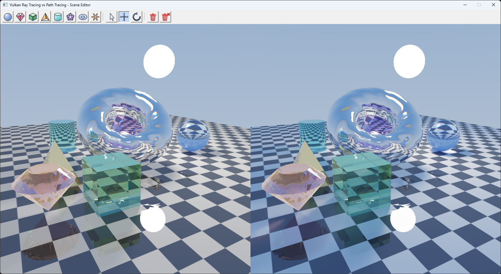

# Vulkan Ray Tracing vs Path Tracing - Scene Editor

An interactive scene editor rendered by two hardware-accelerated renderers at
once (`VK_KHR_ray_tracing_pipeline`): the left half of the window is a classic
Whitted-style ray tracer, the right half is a Monte Carlo path tracer with
global illumination and an SVGF-style denoiser. Both halves share one scene,
one camera and one TLAS, so every edit, drag and orbit is perfectly
synchronized - a live side-by-side of what 1980 ray tracing misses and 1986
path tracing integrates: shadow fill, colour bleeding, caustics.

The two renderers share the miss, shadow-miss and closest-hit shaders and the
whole editor; they differ in exactly one file each - the ray-gen shader
(`raygen_rt.rgen` vs `raygen_pt.rgen`). The display transform (ACES + gamma),
sky, materials and light levels are calibrated to match, so any difference you
see on screen is algorithmic, not tonal.

Zero external dependencies beyond the Vulkan SDK itself: the window and the
toolbar are raw Win32, the icons load through GDI+ (part of Windows), and all
math is inline (no GLFW, no ImGui, no GLM).

## Screenshot
  

## Toolbar

| Group | Buttons |
|-------|---------|
| Shapes | Sphere, diamond, cube, pyramid, cylinder, dodecahedron, supertoroid, supershape - click to add one to the scene |
| Tools  | **Select** (cursor), **Move**, **Rotate** - the active tool is highlighted |
| Danger | **Delete selected** (trash), **Delete all** (trash + ×) |

Icons are pre-rendered anti-aliased PNGs in `icons/`, loaded at runtime with
GDI+ (a system library that ships with Windows, so the zero-dependency rule
still holds). If a PNG is missing, the button falls back to a GDI-drawn icon.

## Mouse

| Input | Action |
|-------|--------|
| **RMB drag** | Orbit the camera (any tool, both halves in sync) |
| Mouse wheel | Zoom |
| **LMB**, Select tool | Click an object to select it; click empty space to deselect; **Shift-click** toggles objects in and out of the selection; **drag** draws a marquee (rubber band) that selects everything it touches (Shift adds to the selection) |
| **LMB drag**, Move tool | Drag the selection in the ground plane; hold **Shift** to move vertically. Grabbing an unselected object selects it first |
| **LMB drag**, Rotate tool | Horizontal drag spins the selection about the world Y axis, vertical drag about the camera's right axis |
| Del | Delete the selection |
| D | Toggle the denoiser on / off (path-traced half) |
| Esc | Quit |

Clicks and drags land in whichever half the cursor is over - both halves show
the same scene from the same camera, so the editor maps the input into that
half's local coordinates (a drag stays anchored to the half it started in).
The selection marquee is drawn by both renderers at the same scene position.

Selected objects get a warm rim highlight rendered by the ray tracer itself;
the marquee rectangle is also composited by the ray-gen shader over the final
image, so there is no GDI flicker over the swapchain.

## Rendering features

- **Monte Carlo path tracing with global illumination** - diffuse surfaces
  bounce with cosine-weighted importance sampling, so indirect light and colour
  bleeding come out of the estimator instead of an ambient constant. Direct
  light uses next event estimation toward the spherical area light, combined
  with BSDF sampling via multiple importance sampling (power heuristic);
  Russian roulette terminates long paths without bias. The HDR accumulation is
  tone-mapped with ACES.
- **SVGF-style a-trous denoiser** - a compute pass after ray tracing runs four
  iterations of an edge-avoiding a-trous wavelet filter guided by the primary
  hit's normal and depth. Radiance is demodulated by the primary-hit albedo
  before filtering (the checkerboard and object colours stay pixel-sharp), the
  filter strength adapts to the per-pixel sample count (1/sqrt(n)), and glass
  pixels pass through unfiltered. Press `D` to compare against the raw
  path-traced output; the editor marquee is re-composited by the final pass.
- **Instanced acceleration structures** - one BLAS per shape type, built once
  with `PREFER_FAST_TRACE`. Every scene object is a TLAS instance carrying its
  own 3×4 transform, so moving, rotating, adding or deleting an object only
  rewrites the instance buffer and rebuilds the TLAS - the triangle geometry
  is never touched.
- **Per-instance materials** - colour, material id, reflectivity and the
  selection flag live in an SSBO indexed with `gl_InstanceCustomIndexEXT` in
  the closest-hit shader; normals go from object to world space through
  `gl_ObjectToWorldEXT`.
- **Dispersive Fresnel glass** - per-channel IOR 1.50/1.52/1.54 with
  hero-wavelength sampling, total internal reflection, coloured glass tint,
  and real refractive caustics on the floor as the accumulation converges.
- **Soft shadows** from a visible spherical area light, which is also the key
  light of the path-traced scene (cone sampling with a distance-dependent
  penumbra).
- **Per-pixel adaptive temporal accumulation** - static pixels converge to a
  clean image; pixels whose primary hit moved reset, so dragged objects stay
  sharp. Glass pixels additionally track a deterministic path-length signature
  through the refractive chain, so dragging an object behind or inside glass
  resets exactly the affected pixels instead of smearing into ghosts. Any edit
  also restarts accumulation so changes always show up clean.
- Ray-gen / closest-hit / two miss shaders, a correctly aligned shader binding
  table, `maxPipelineRayRecursionDepth = 1` (all bounces iterate in ray-gen).

## Requirements

- Windows 10/11, x64
- A GPU with `VK_KHR_ray_tracing_pipeline` support (NVIDIA RTX, AMD RX 6000+,
  Intel Arc) and recent drivers
- [Vulkan SDK](https://vulkan.lunarg.com/) (the `VULKAN_SDK` environment
  variable must be set - the installer does this)
- Visual Studio 2022+ with the C++ workload

## Building

Open `VulkanRTSceneEditor.sln` and build (x64, Debug or Release). The
pre-build step compiles the GLSL shaders to SPIR-V with the SDK's
`glslangValidator`; the post-build step copies them next to the executable.

## Architecture notes

The editor path is deliberately cheap. On any scene edit:

1. The instance array (`VkAccelerationStructureInstanceKHR`, one per object)
   and the per-object shading SSBO are rewritten on the host.
2. The TLAS is rebuilt (`PREFER_FAST_BUILD`) - with at most 64 instances this
   is sub-millisecond.
3. The accumulation counter resets, and the per-pixel history test
   additionally resets exactly the pixels whose primary hit moved.

BLASes are static and never rebuilt, which is what lets them use
`PREFER_FAST_TRACE` for maximum traversal performance. Object picking is a
CPU ray against per-instance bounding spheres; marquee selection projects the
same bounding spheres to the screen and tests them against the rectangle.

## License

MIT License

Copyright (c) 2026 Mykhailo Makarov

Permission is hereby granted, free of charge, to any person obtaining a copy
of this software and associated documentation files (the "Software"), to deal
in the Software without restriction, including without limitation the rights
to use, copy, modify, merge, publish, distribute, sublicense, and/or sell
copies of the Software, and to permit persons to whom the Software is
furnished to do so, subject to the following conditions:

The above copyright notice and this permission notice shall be included in all
copies or substantial portions of the Software.

THE SOFTWARE IS PROVIDED "AS IS", WITHOUT WARRANTY OF ANY KIND, EXPRESS OR
IMPLIED, INCLUDING BUT NOT LIMITED TO THE WARRANTIES OF MERCHANTABILITY,
FITNESS FOR A PARTICULAR PURPOSE AND NONINFRINGEMENT. IN NO EVENT SHALL THE
AUTHORS OR COPYRIGHT HOLDERS BE LIABLE FOR ANY CLAIM, DAMAGES OR OTHER
LIABILITY, WHETHER IN AN ACTION OF CONTRACT, TORT OR OTHERWISE, ARISING FROM,
OUT OF OR IN CONNECTION WITH THE SOFTWARE OR THE USE OR OTHER DEALINGS IN THE
SOFTWARE.

## Support

If you found this project interesting or useful, you can support my work:

